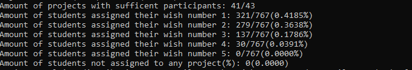
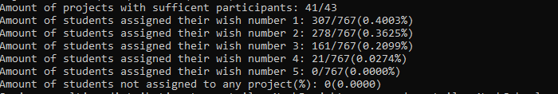

Usage of program:
Use startAlgorithm.bat or simply copy-paste the command from the file into your own cmd.

Change the command line arguments to your own preferences, they are explained below.
1. Parameter: Path to csv-file of projects
2. Parameter: Column explanation for the csv-file of projects:
    - First symbol is the seperator symbol
    - Then in column order, add symbol:
    - I for project ID, m for minimal amount of participants of project, M for maximal amount of participants in project, ; for all other columns
    - Example: ,ImM means: Seperator is ',', in the first column is the id of the project, the second column has the min amount of participants and the last column has the maximum amount of participants
3. Parameter: Path to csv-file for students
4. Parameter: Column explanation for the csv-file of students:
    - Like above, first symbol is seperator symbol
    - Then in column order, add symbol:
    - K for student grade, I for student ID, 1 for their 1. wish, 2 for their 2. wish and so on, ; for all other columns.
    - Example: ,KI12345 means: Seperator is ',', in the first column is the grade level of the student, the second column contains the student id, the third the student's first wish, and so on.
5. Parameter: This parameter is called punish-terms and is a list of length (amount of wishes + 1). The j-th element
represents the amount of penalty points the IP gives the assignment of a student to their j-th wish. The last element of the list
represents the amount of penalty points the IP gives when it can not assign a student to any of their wishes. This parameter can be freely chosen
and is discussed below in more detail.
6. Parameter: The amount of time (in seconds) the solver is allowed to solve. The default should suffice. If at any point the optimization status
is not optimal anymore, i.e. the solver would need more time to fully solve the model, consider increasing this to achieve better solutions. Note that this also
heavily influences the amount of time the suggestion system needs.
7. Parameter: Is called MAX_UB_INCREASE and is part of the suggestion system. Discussed below.
8. Parameter: Is called MIN_LB_PERCENTAGE and is part of the suggestion system. Discussed below.
9. Parameter: Is called PRINT_TOP_N_UB_SUGGESTIONS and is part of the suggestion system. Discussed below.
10. Parameter: Is called NUM_TOTAL_CHANGES and is aprt of the suggestion system. Discussed below.
11. Parameter: Is called PRINT_TOP_N_MULTIPLE_SUGGESTIONS and is part of the suggestion system. Discussed below.

### Punish-Terms parameter
For five wishes, the default [0,1,4,9,16,1000] is reasonable.
The first entry of this parameter should always be zero, as it does not make sense to punish the assignment to the first wish.
The values of the list should also be strictly increasing and the last entry should be very high to discourage the algorithm
from trying not to assign students. Besides that, the choice of values is free to the user and has different effects to the solution produced.

The solution the IP solver is always optimal in the sense that it minimizes the total sum of penalty points. Solutions can still change
if the punish-terms change, of course, as the weighting is different. This can be observed in the following case study:

Using the default quadratically punishing [0,1,4,9,16,1000], we get the following optimal distribution on an example dataset:

Using the same dataset and a cubically punishing [0,1,8,27,64,1000], we get the following optimal distribution:

Because the assignment to the 4-th wish is punished very heavily using cubic terms, the distribution shifts away students from their 4-th in
exchange for shifting some students from their 1st wish to something worse. 

It is unclear to us which punish-terms vector should be used, hence why this parameter is freely changeable.

### Suggestion system
After successfully solving the original problem, a suggestion system is started which consists of three types of suggestions:
- For each project that does not have a sufficient amount of participants, we try lowering the lower bound of acceptable participants one-by-one
until the objective value is improved, which also means that then this project would be assigned a sufficient amount of participants. Lowering of the lower bound
is done either until a better solution is found or until the lower bound gets too low, which is what the parameter MIN_LB_PERCENTAGE is for. 
The lowest possible bound is given by `MIN_LB_PERCENTAGE * original_lower_bound`
- For all projects that do have sufficient amount of participants, we try increasing the upper bound of acceptable participants one-by-one
and record the amount the objective value has improved. The maximum amount the upper bound is increased by is given by MAX_UB_INCREASE.
Finally, the best improvements are printed to the console. The amount of prints to the console is given by PRINT_TOP_N_UB_SUGGESTIONS.
- In the third type, we allow all participants bounds to be changed freely, upto a total amount given by NUM_TOTAL_CHANGES. The IP is resolved
with these bounds allowed to change (optimization also optimize over how the bounds should be changed), and the best PRINT_TOP_N_MULTIPLE_SUGGESTIONS are printed.
The top solutions usually entail changing the bounds of more than one project, hence the name MULTIPLE.

It is clear that not every suggestion the program makes can be followed as the lower and upper bound for each project were set with good reason.
However, in some cases it may still help.

The suggestion system can hence be disabled by setting MAX_UB_INCREASE to 0, MIN_LB_PERCENTAGE to 1 and PRINT_TOP_N_MULTIPLE_SUGGESTIONS to 0. 